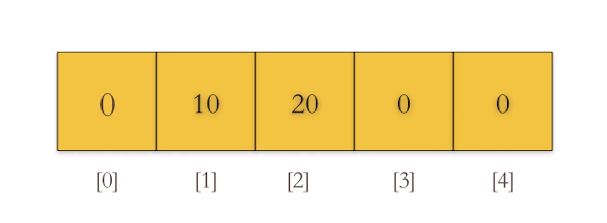

# 数组

同一种数据类型的固定长度的序列。
Go语言的数组底层实现就是一段连续的内存空间。每个元素有唯一一个索引(或者叫下标)来访问。如下图所示，下图是[5]int{1:10, 2:20}数组的内部实现逻辑图:

从上图也可以看出，go语言的数组是一个值，而很多其他语言的数组变量是指向数组第一个元素的指针。
所以go语言的数组是值类型，在传递时，是传递的原数组的拷贝。

数组定义：var a [len]int
`var a[6]int`

## 重点：

* 长度是数组类型的一部分，所以 a[5]int 和 a[10]int 是不同的类型

