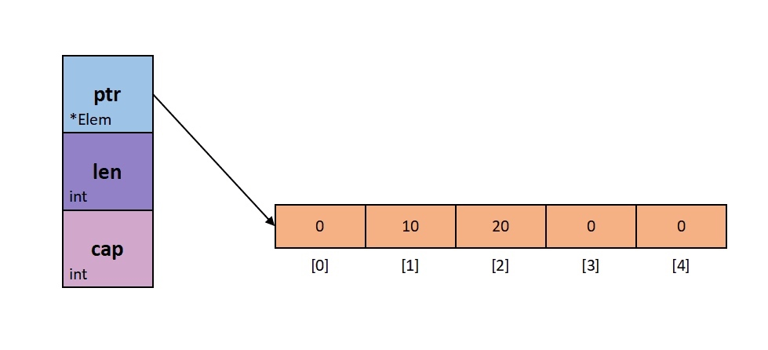
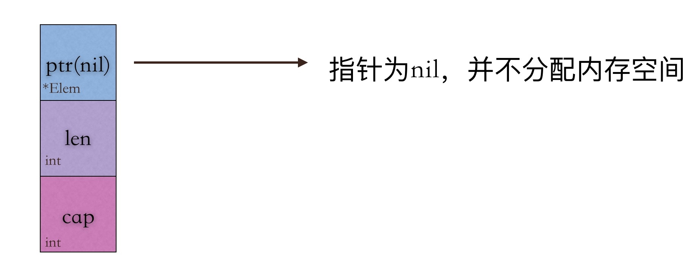
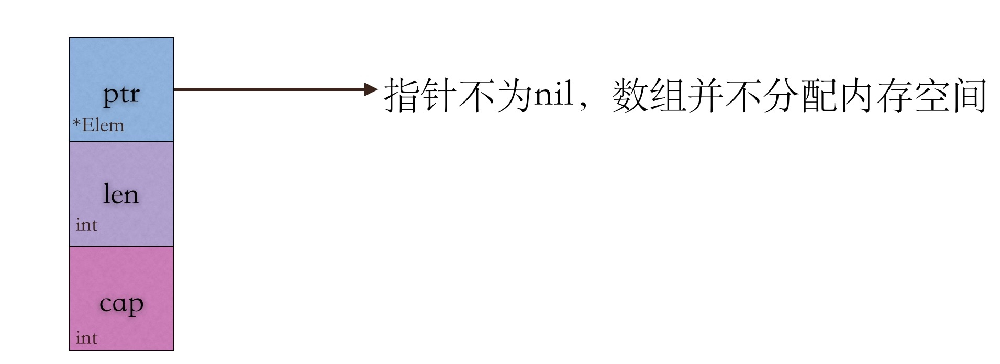

# slice切片

切片是对数组的抽象。它的数据结构是：




切片从图中可以看出：
1. 指向数组的指针
2. 切片的长度 len
3. 切片的容量 cap

## 切片的声明


```
s := make([]byte,lense'''''''''''')
例如： s:= make([]int,10)

s := []byte{...}
```

注意nil切片和空切片




空切片指针不为nil，而nil切片指针为nil。但是，不管是空切片还是nil切片，对其调用内置函数append()、len和cap的效果都是一样的，感受不到任何区别。

所以slice就是一个动态数组。

## 扩容

请记住以下两条规则：

* 如果切片的容量小于1024个元素，那么扩容的时候slice的cap就翻番，乘以2；一旦元素个数超过1024个元素，增长因子就变成1.25，即每次增加原来容量的四分之一。

* 如果扩容之后，还没有触及原数组的容量，那么，切片中的指针指向的位置，就还是原数组，如果扩容之后，超过了原数组的容量，那么，Go就会开辟一块新的内存，把原来的值拷贝过来，这种情况丝毫不会影响到原数组。

## slice的修改

因为slice的引用类型这个特点，如果修改了slice的某一个元素，那么引用同一个底层数组的slice相对应的值都会改变，但是有时候；我们只是需要这些值，并做一下修改；那么我们就需要对slice进行操作

### slice复制成另外一个相同的slice

**copy(得到slice,源slice)**

```
    slice := []int{0, 1, 2, 3, 4}
    slice2 := slice[1:4]

    slice4 := make([]int, len(slice2))

    copy(slice4, slice2)
```

通过copy函数，底层的匿名数组不一样，所以修改它不会产生错乱。

### slice追加


```
slice := make([]int, 1, 2)
    slice[0] = 111

    fmt.Printf("slice %v, slice addr %p, len %d, cap %d \n", slice, &slice, len(slice), cap(slice))

    slice = append(slice, 222)
    fmt.Printf("slice %v, slice addr %p, len %d, cap %d \n", slice, &slice, len(slice), cap(slice))
```
使用append函数，就可以追加元素到原切片后面。

append（原slice，想要追加的元素）

### slice与函数参数

这里有一些具体的细节，[go函数切片的参数是值传递还是引用传递？](https://www.jianshu.com/p/7439e7ae3c4c)可以学习一下，底层实现。


